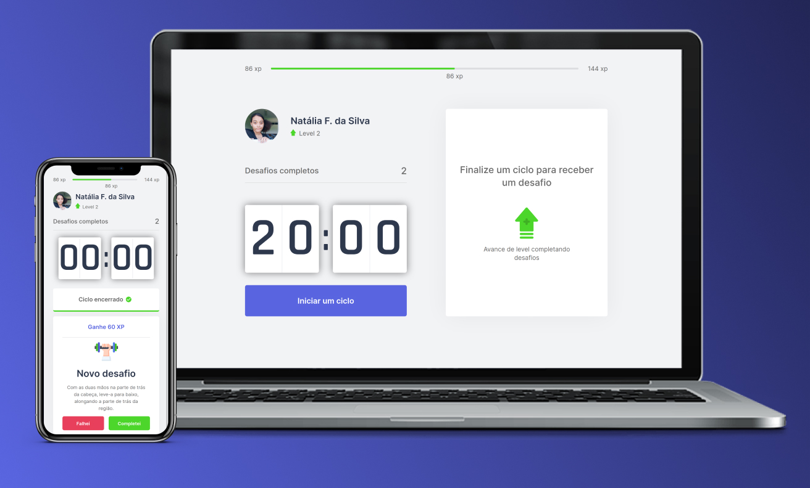

<div align="center">
    
</div>

___

Desenvolvida durante a NLW#4, da Rocketseat, esta aplicação tem como objetivo gameficar a prática de exercícios para pessoas que passam longos períodos de tempo sentados em frente a um computador e/ou notebook.

## Tecnologias 
* React
* Next.js
* Typescript

## Preview
<div align="center">
    
</div>

Você pode testar a minha versão do move it clicando [aqui](https://movit-nlw4-eight.vercel.app/) 🖥
___

## Como executar a aplicação localmente

- Clone o repositório
- Acesse a pasta do projeto e instale as dependências:

```
yarn
```

- Execute a aplicação:

```
yarn dev
```

- Veja o resultado em [http://localhost:3000](http://localhost:3000)
